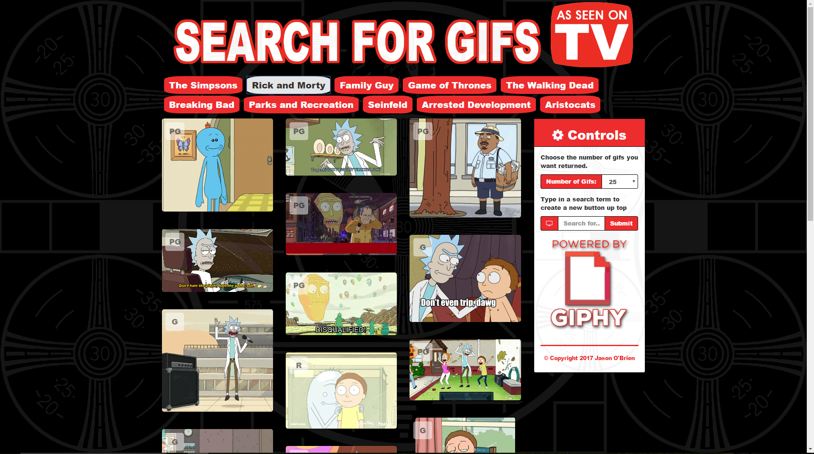

# GiphyAPI

https://fathomless-gorge-56781.herokuapp.com/

### Overview

Week 6 Project for the UCF Coding Bootcamp. In this assignment, I made a gif search app using the GIPHY API ta make a dynamic web page that populates with gifs of the users choice. It calls the GIPHY API and uses JavaScript and jQuery to change the HTML of the site.

### Instructions

1. In the sidebar to the right you can type in a search term and change the number of gifs returned .

   * click the search button or hit enter to return your results and make a link button up top.

2. The site has a TV show theme and the preloaded buttons are some of my favorite TV shows.

   * It's just a theme though you are not limited to only TV shows, you can use any term you like.

3. When the user clicks on a button, the page will grab 10 static, non-animated gif images from the GIPHY API and place them on the page.

4. When the user clicks one of the still GIPHY images, the gif will animate. If the user clicks the gif again, it will stop playing.

5. In the upper left corner of every gif it shows the rating (PG, G, so on).

   * This data is provided by the GIPHY API.

- - -

## Copyright

Jason O'Brien (C) 2017.
